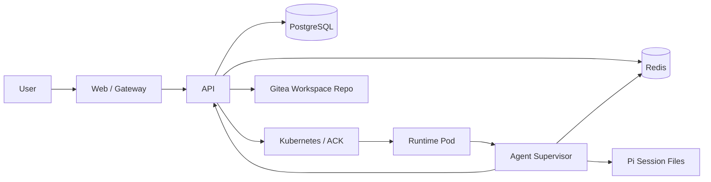
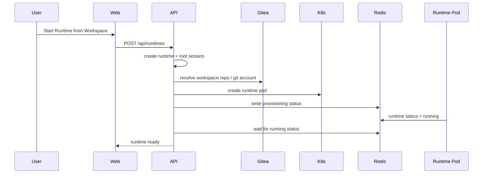
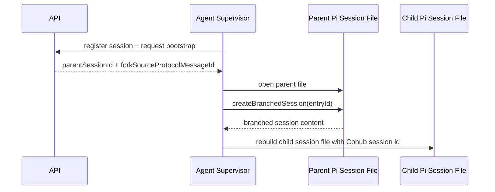

# Agent 基础设施架构设计方案

本文档描述 Cohub 当前 Agent 基础设施与运行面设计。

请注意，这套基础设施设计服务于项目的核心目标：

> **Workspace 托管 + 云端 Runtime 运行 + Runtime 内部 Agent 执行**

因此本文的重点不是孤立讨论 Session，而是说明：
- Runtime Pod 是如何启动的
- Workspace 是如何进入 Runtime 的
- Agent Supervisor 在 Pod 内承担什么职责
- Redis / API / Pi 是如何协作的
- Session fork 在执行层如何对接 Pi session file

---

## 1. 整体架构概览

当前系统的主要链路如下：



其中：
- **API** 是控制平面
- **Agent Supervisor** 是执行平面
- **Redis** 是实时消息中枢
- **PostgreSQL** 是最终持久化存储
- **Pi** 是 Runtime 内部的底层 Agent 执行引擎
- **Gitea** 提供 Workspace 仓库来源

---

## 2. Runtime Pod 模型

每个 Runtime 启动时，API 会通过 K8s API 创建一个独立 Pod。

### Pod 当前职责
- 挂载 Workspace 目录
- 运行 `apps/agent`
- 与 Redis 通信
- 与 API 内部接口通信
- 使用 Pi coding agent 执行会话

### Pod 在平台中的角色
Runtime Pod 不是孤立沙箱，而是：

> **某个 Workspace 在云端的运行载体。**

Workspace 是输入，Runtime Pod 是执行体，Agent 是 Pod 内的工作负载。

---

## 3. API 侧的 Provisioning 流程

Runtime 创建后，API 会异步进行 Provisioning。

### Provisioning 阶段
1. `queued`
2. `init_git_account`
3. `prepare_workspace`
4. `create_pod`
5. `bind_channels`
6. `wait_runtime_running`
7. `completed`

### API 做的事
- 准备 Git 凭据
- 构造 Workspace 仓库 clone URL
- 生成 Pod 模板
- 注入 Runtime 环境变量
- 调 K8s API 创建 Pod
- 绑定 Runtime Channel 到 Gateway
- 轮询 Redis runtime status，等待 Supervisor 报告 running

### 时序图



### Provisioning 状态存放
Provisioning 的实时状态存放在 Redis：
- meta hash
- event stream

Web 通过 API 查询展示 provisioning 过程。

---

## 4. Agent Supervisor 的职责

Runtime Pod 内运行 `apps/agent`，它是一个 Supervisor。

### 4.1 它负责什么

#### 1. 容器初始化
- 调 `initializeContainer()`
- 准备 Workspace 目录
- 初始化 Pi 所需运行环境

#### 2. 维护多个 Session handle
当前一个 Runtime 可以有多个 Session。  
Supervisor 用 `sessionHandles: Map<sessionId, SessionHandle>` 维护它们。

每个 handle 包含：
- `sessionId`
- `session`（Pi AgentSession）
- `sessionManager`
- `currentUserMessageId`

#### 3. 监听 Redis 输入队列
Supervisor 会持续从 Runtime 的 input queue 消费输入。

当前核心输入是：
- `prompt`

#### 4. 向 Redis 输出流发送实时事件
Supervisor 订阅 Pi session 事件后，把事件包装成：
- `agent_event`
- `error`

写入 Runtime output stream，供 API / Web 消费。

#### 5. 持久化 assistant message
当 Pi 发出 `turn_end` 时，Supervisor 会调用 API 内部接口，持久化：
- assistant message
- tool results
- usage / cost / metadata

#### 6. 处理 Session fork 的本地执行态恢复
当某个 Session 是 fork Session 且本地尚无 session file 时，Supervisor 会尝试基于 parent Pi session file 构建 child Pi session file。

---

## 5. Runtime 输入输出协议

## 5.1 Redis 输入

当前 Runtime 输入队列中主要是：

```json
{
  "action": "prompt",
  "runtimeId": "...",
  "sessionId": "...",
  "userMessageId": "...",
  "message": {
    "text": "...",
    "images": []
  },
  "meta": {
    "source": "web|channel:*",
    "intent": "continue|new_session|fork|auto"
  }
}
```

### 说明
- 每个 prompt 必须明确属于某个 Runtime 和某个 Session
- fork 总是在 API 层先创建新的 Session
- Agent 执行时只处理已经确定好的目标 Session

## 5.2 Redis 输出

Supervisor 会把 Pi 事件转成 JSON 后写入 Runtime output stream。

常见事件包括：
- `agent_event.message_update`
- `agent_event.turn_end`
- `error`

Web 再通过 API 的 SSE 接口消费这些事件。

---

## 6. Pi session 的使用方式

## 6.1 一般原则
当前系统采用：

> **一个 Cohub Session 对应一个 Pi session file。**

这有两个重要好处：
- identity 对齐
- fork / restore 更稳定

## 6.2 Session 恢复
当收到某个 `sessionId` 的 prompt 时，Supervisor 会：
1. 看内存里是否已有对应 handle
2. 若有，直接复用
3. 若无，尝试查找本地 session file
4. 若本地已有 session file，则恢复该 Pi session
5. 若本地没有，则进一步判断它是否为 fork Session

---

## 7. Session fork 在 Agent 执行层的实现

这是当前设计中的关键点。

### 7.1 控制平面的 fork
API 在执行 `POST /api/sessions/:id/fork` 时会完成：
- child Session 的 DB 创建
- lineage 字段写入
- 线性消息复制

### 7.2 Bootstrap 信息
Supervisor 在第一次加载 Session 时，会向 API 的内部 register session 接口请求 bootstrap 信息。

如果该 Session 是 fork 出来的，bootstrap 中会包含：
- `parentSessionId`
- `forkSourceProtocolMessageId`

其中：
- `forkSourceProtocolMessageId` 就是 parent Session 中那条 source message 对应的 Pi entry id

### 7.3 当前 fork 执行流程
如果 child Session 本地还没有 Pi session file，并且 bootstrap 告知它是 fork Session，那么 Supervisor 会：

1. 找到 parent Session 对应的 Pi session file
2. `SessionManager.open(parentSessionFile)`
3. 调用 `createBranchedSession(forkSourceProtocolMessageId)`
4. 打开这个 branched session file
5. 再创建一个新的 session，并把 session id 改写为 Cohub child Session id
6. 将 branched entries 逐条 append 到新的 session file 中
7. 用这个重建后的 session file 创建新的 Pi AgentSession

### 时序图



### 为什么要重写 child file
因为 Pi 自己生成 branched session 时，会生成自己的 session id。  
而 Cohub 的系统要求：

> **数据库中的 Session id 和 Pi session file 中的 session id 尽量一一对应。**

---

## 8. assistant message 持久化链路

### 8.1 Pi turn_end 事件
Pi 在一个 turn 结束时会发出：
- final assistant message
- tool results

### 8.2 Supervisor 做的事
Supervisor 会从 turn_end 中提取：
- assistant content
- tool call records
- usage / provider / model / stopReason
- assistant id（作为 `externalMessageId` / `protocolMessageId`）

然后调用 API 内部接口持久化。

### 8.3 API 做的事
API 会：
- 线性 append assistant message 到 `session_messages`
- 写入 `protocolMessageId`
- 写入 `session_tool_calls`
- 更新 session totals
- 如果有 channel binding，则派发 outbound

---

## 9. Session 与 Pi entry 的映射

当前设计里，Session fork 要求知道：

> 数据库中某条 Message 对应 Pi session file 里的哪个 entry。

因此 `session_messages` 表保留：
- `protocolMessageId`

在 Pi 场景中：
- 它对应 Pi entry id

这使得 fork 可以从 Cohub Message 精确映射到底层 Pi entry。

---

## 10. 一句话总结

> 当前 Agent Infra 的核心是：API 基于 Workspace 编排 Runtime，Agent Supervisor 在 Runtime Pod 内运行 Pi session，并通过 Redis 和 API 协作；Session fork 在控制平面落库，在执行平面通过 parent Pi session file + source Pi entry 重建 child Pi session file。 
