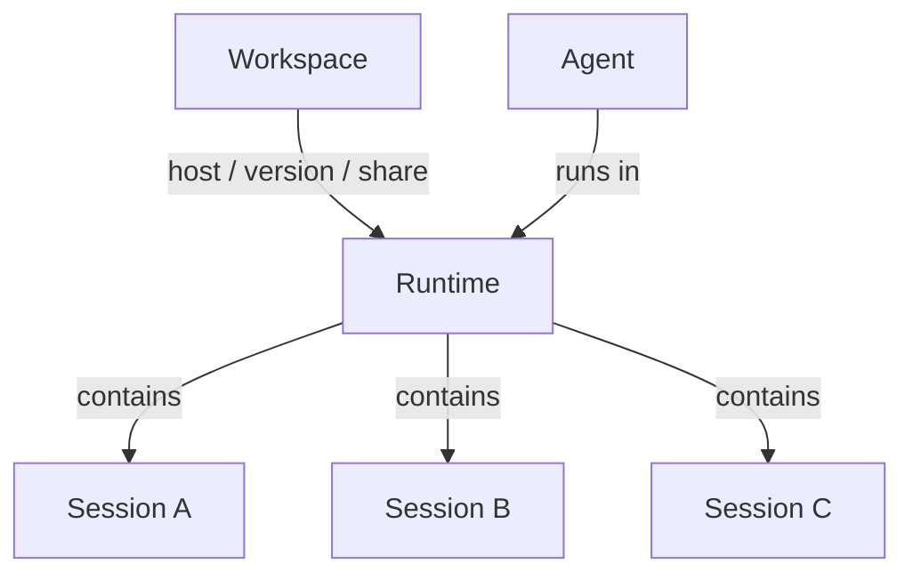
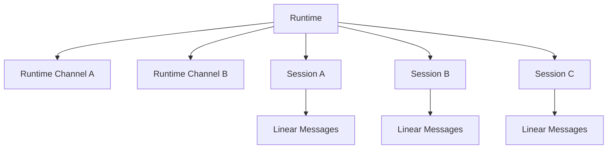
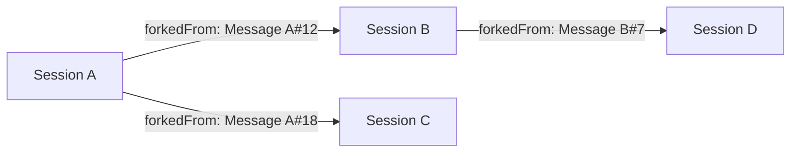
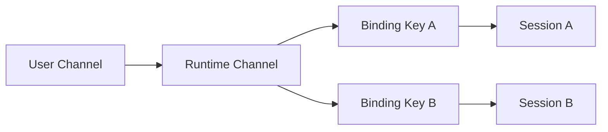

# Runtime / Session Model

本文档定义 Cohub 当前统一采用的 Runtime / Session 运行时模型。

请注意，这个模型服务于项目的核心目标：

> **Workspace 托管 + 云端 Agent 运行**

也就是说：
- **Workspace** 是平台最核心的托管资产
- **Runtime** 是从 Workspace 启动出来的云端运行实例
- **Session** 是 Runtime 内部的执行上下文组织方式

因此，Session / Fork / Channel 都是围绕 Runtime 展开的内部运行时模型，而不是脱离 Workspace / Runtime 单独存在的产品中心。

---

## Short version

- **Workspace** 是项目托管与云端运行输入单元
- **Runtime** 是基于 Workspace 启动的外层云端运行实例
- **Session** 是 Runtime 内的独立线性上下文
- **Message** 是 Session 内的线性消息记录
- **Fork** 是从某个 Session 的某条 Message 生成新的 Session
- **Channel** 是外部通信端点，始终绑定到 Session

一句话：

> **Users host Workspaces, start cloud Runtimes from them, and interact with one or more Sessions inside those Runtimes.**

---

## 1. 核心对象关系

### 1.1 平台主关系



### 1.2 Runtime 内部关系



### 1.3 通信层级

```text
Channel <-> Runtime <-> Session
```

更准确地说：

```text
UserChannel
  -> RuntimeChannel
      -> RuntimeSessionBinding
          -> RuntimeSession
```

---

## 2. Runtime

Runtime 是外层生命周期与执行实例。

在项目整体中，Runtime 是从 Workspace 启动出来的云端运行对象，是用户真正“进入”的执行入口。

### Runtime 拥有
- 运行状态
- Sandbox / Pod 状态
- Runtime Channel 挂载
- 多个 Session
- 输出流（SSE / Redis Stream）

### Runtime 负责的事
- 基于 Workspace 创建运行实例
- Provision K8s Pod
- 绑定 Channel
- 暴露运行状态与输出流
- 提供 Runtime 维度的 Session 列表和 Session Graph

---

## 3. Session

Session 是 Runtime 内部的独立上下文容器。

### 3.1 Session 的本质
Session 被定义为：

- 一个独立的线性会话
- 一个可持续接收消息的上下文容器
- 一个可被 Channel routing 命中的目标
- 一个可从其它 Session 的某条 Message fork 出来的子 Session

### 3.2 Session 的线性结构
Session 内的消息按照线性顺序组织，核心字段是：
- `sequence`
- `prevMessageId`

### 3.3 Session lineage
Session 之间通过下面字段建立 lineage：
- `parentSessionId`
- `forkedFromMessageId`
- `lineageRootSessionId`
- `forkDepth`

这允许我们表达：

> Session B 是从 Session A 的某条 Message fork 出来的。

---

## 4. Message

Message 是 Session 内部的线性消息记录。

### 每条 Message 的作用
- 表示用户 / assistant / system 的一条记录
- 保存 content / provider / model / usage / error 等数据
- 作为 Session fork 的锚点

Message 在当前模型中不承担外部路由职责。  
外部 conversation 仍然由 Session 承接。

---

## 5. Fork

Fork 是当前模型中的分叉机制。

### 5.1 语义
从：
- 某个 Session
- 某条 Message

创建：
- 一个新的子 Session

### 5.2 fork 后发生什么
1. 创建新的 child Session
2. child Session 写入：
   - `parentSessionId`
   - `forkedFromMessageId`
   - `lineageRootSessionId`
   - `forkDepth`
3. 将父 Session 从头到 source Message 为止的线性上下文复制到 child Session
4. 后续输入继续写入 child Session

### 5.3 Session Graph 关系图



### 5.4 Graph 的主体
Session Graph 的：
- 节点 = Session
- 边 = `parentSessionId`
- 边的说明 = `forkedFromMessageId` 对应的 Message 摘要

所以 Graph 的主体仍然是 Session，Message 只是 fork 锚点。

---

## 6. Channel 设计

### 6.1 Channel 先绑定 Runtime
通过：
- `user_channels`
- `runtime_channels`

表达：

> 某个用户配置的外部 Channel 被挂载到某个 Runtime 上。

### 6.2 外部会话再路由到 Session
通过：
- `runtime_session_bindings`

表达：

```text
(runtimeChannelId, bindingKey) -> runtimeSessionId
```

### 6.3 Runtime / Session / Channel 关系图



### 6.4 为什么绑定 Session
因为外部 chat / thread / topic 的后续消息流需要一个持续上下文容器承接。  
这个对象是 Session，而不是 Message。

---

## 7. API layering

### Runtime-facing APIs
用于外层生命周期与运行视角：
- `POST /api/runtimes`
- `GET /api/runtimes/:id`
- `GET /api/runtimes/:id/sessions`
- `GET /api/runtimes/:id/session-graph`
- `GET /api/runtimes/:id/stream`
- `GET /api/runtimes/:id/provisioning`

### Session-facing APIs
用于会话与会话分叉：
- `GET /api/sessions/:id`
- `GET /api/sessions/:id/messages`
- `POST /api/sessions/:id/messages`
- `POST /api/sessions/:id/fork`

---

## 8. UI terminology

建议 UI 和团队内部统一使用下面术语：

### 推荐用法
- Runtime Console
- Runtime Sessions
- Session Graph
- Fork from this message
- Fork source message

---

## 9. Pi 集成下的语义对齐

当前项目底层使用 Pi coding agent。

### 9.1 Cohub Session 与 Pi session file 的关系
目标是：

> **一个 Cohub Session 对应一个 Pi session file。**

### 9.2 Fork 时如何对接 Pi
Fork 新 Session 时：
- Cohub DB 先创建 child Session 并复制线性消息历史
- Agent 侧第一次加载该 child Session 时，会获取 bootstrap 信息
- 如果该 Session 有 `parentSessionId + forkSourceProtocolMessageId`，Agent 会：
  1. 打开父 Pi session file
  2. 基于指定 Pi entry 做 branched session extraction
  3. 重写为新的 Pi session file，sessionId 与 Cohub Session id 一致

这样实现：
- DB session 和 Pi session file 一一对应
- 子 Session 尽量继承父 Session 到 fork 点的 Pi 上下文

---

## 10. 典型场景

### 场景 A：Web 中从某条历史消息继续
1. 用户在 Session A 的某条 Message 上点“fork”
2. 调用 `POST /api/sessions/:id/fork`
3. 创建 Session B
4. UI 切换到 Session B
5. 后续消息进入 Session B

### 场景 B：外部 thread 映射为新 Session
理想语义是：
- 原 channel 主线 -> Session A
- 某条消息上开 thread -> Session B
- Session B 的 `parentSessionId = A`
- Session B 的 `forkedFromMessageId = M`
- 新 thread 的 bindingKey 路由到 Session B

---

## 11. One-sentence rule

如果遇到模型歧义，统一按下面规则判断：

> **Cohub 的核心是 Workspace 托管与云端 Runtime 运行；Session 是 Runtime 内部的线性上下文；Fork 会从某条 Message 创建新 Session；Channel 始终路由到 Session。**
