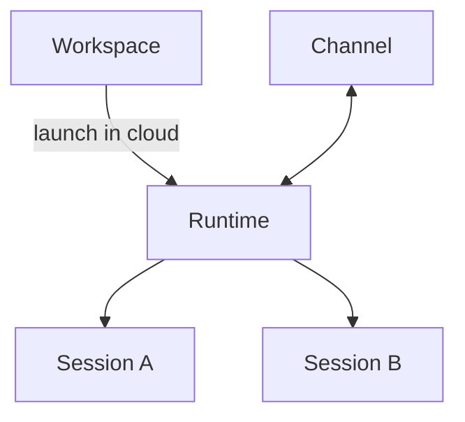
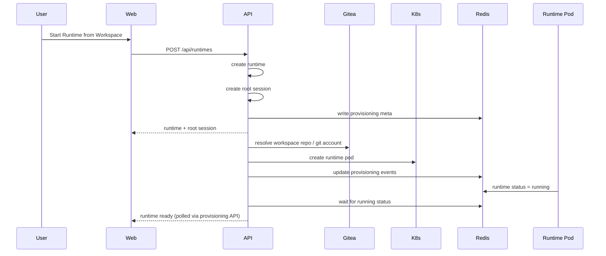
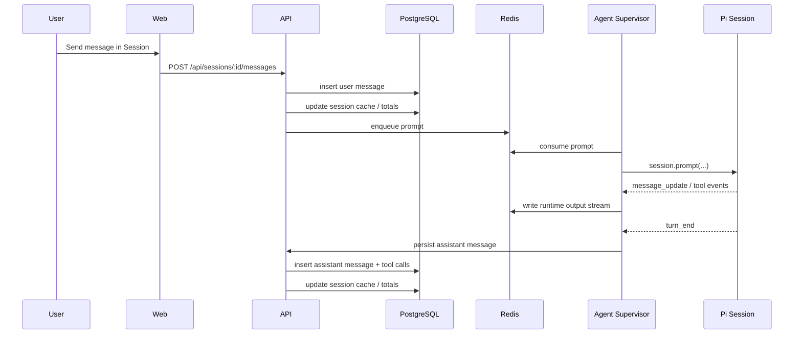
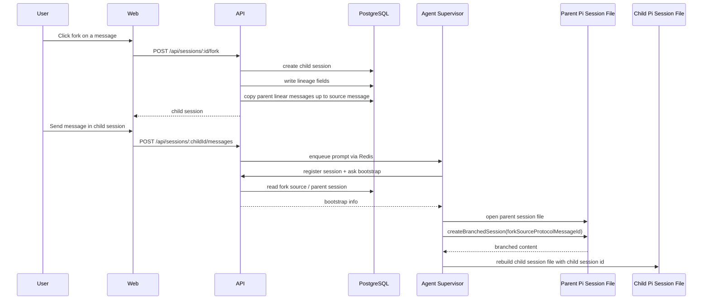

# Technical Architecture

本文档描述 Cohub 当前整体技术架构,重点面向技术团队说明:

- 项目的核心仍然是 **Workspace 托管 + 云端 Agent 运行**
- 各应用和共享包的职责边界
- Runtime / Session / Channel 的系统实现方式
- Web / API / Agent / Gateway / Redis / K8s / Gitea / Pi 的协作关系
- 关键请求链路与事件链路

请注意:

> Session / Fork / Channel 都服务于 Runtime,而 Runtime 又服务于 Workspace 的云端运行与托管价值。

换句话说,当前项目的核心不是单纯的聊天或会话系统,而是:

> **让 Workspace 成为可托管、可启动 Runtime、可在云端持续运行 Agent 的平台资产。**

---

## 1. Monorepo 结构

当前仓库采用 pnpm monorepo 组织。

```text
cohub/
├── apps/
│   ├── api/       # Hono API，负责编排、持久化、路由、Provisioning
│   ├── agent/     # Runtime Pod 内 Supervisor，封装 Pi coding agent
│   ├── gateway/   # 外部 Channel provider 网关（独立运行）
│   ├── web/       # SvelteKit 控制台
│   └── worker/    # 任务调度器，负责 cron job 与异步任务执行
├── packages/
│   └── protocol/  # API / Agent / Gateway / Worker 共享协议
├── docs/
└── deploy/
```

---

## 2. 总体架构图

```mermaid
flowchart LR
    U[User]
    W[Web Console<br/>SvelteKit]
    G[Gateway<br/>Channel Providers]
    A[API<br/>Hono]
    WR[Worker<br/>Task Scheduler]
    R[(Redis)]
    P[(PostgreSQL)]
    K[Kubernetes / ACK]
    RT[Runtime Pod]
    S[Agent Supervisor<br/>apps/agent]
    PI[Pi Coding Agent<br/>Session Files]
    GT[Gitea]
    WS[Workspace Repos]

    U --> W
    U --> G

    W --> A
    G --> A

    A --> P
    A --> R
    A --> K
    A --> GT
    A --> WR
    GT --> WS

    WR --> R
    WR --> P

    K --> RT
    RT --> S
    S --> PI

    A --> WS
    S --> R
    S --> A
```



### 架构解读

这张图强调了项目真正的中心:

1. **Workspace 由 Gitea 托管**,是平台中的长期资产
2. **Runtime 由 API 编排并在 K8s 中启动**,是云端运行实例
3. **Agent Supervisor + Pi** 是 Runtime 的执行内核
4. **Web / Gateway** 是 Runtime 的交互入口,而不是系统主资产

---

## 3. 组件职责

## 3.1 `apps/web`

Web 控制台,负责:
- Workspace 管理
- Runtime 创建与查看
- Session 列表与聊天界面
- Session Graph 独立页面
- Provisioning 状态展示
- Runtime 输出流订阅

Web 不直接连接 Runtime Pod,而是始终通过 API 访问。

---

## 3.2 `apps/api`

系统核心控制平面,负责:
- 用户鉴权与 API 出口
- Workspace / Runtime 的编排
- Runtime 创建 / Provisioning / 状态查询
- Session 持久化
- Session fork
- Channel 绑定与路由
- Runtime 输出流透传
- Agent / Gateway 的内部接口

它是整个系统的编排中心。

---

## 3.3 `apps/agent`

运行在 Runtime Pod 内部的 Supervisor。

负责:
- 初始化容器运行环境
- 管理一个 Runtime 下的多个 Session handle
- 通过 Pi coding agent 执行 prompt
- 接收 Redis 输入队列中的 prompt
- 将输出事件写入 Redis stream
- 将 assistant turn_end 持久化回 API
- 在 fork Session 时,对接 Pi session file 的 fork 能力

它不是对外暴露的 API,而是 Runtime 内部执行面。

---

## 3.4 `apps/gateway`

Gateway 负责外部 Channel provider 接入。

职责包括:
- 拉起 Discord / Telegram / Feishu 等 provider 连接
- 将外部 inbound event 规范化后写入 Redis inbound stream
- 接收 outbound command 后发回外部 provider

API 不直接接 provider SDK,而是通过 Gateway 解耦。

---

## 3.5 `apps/worker`

任务调度器，独立于 API 和 Gateway 运行。

负责：
- Cron Job 定时任务调度（基于 BullMQ + Redis）
- 异步任务执行与重试
- 任务运行记录持久化
- 与 API 共享 `cron_jobs` 和 `task_runs` 表

它是 API 的异步执行面，不对外暴露 HTTP 接口。

---

## 3.6 `packages/protocol`

共享协议层。

负责定义：
- Runtime prompt 输入结构
- Session 持久化结构
- Gateway inbound / outbound 结构
- Workspace 相关共享协议
- 任务调度与权限相关类型

它是 apps 之间的契约层。

---

## 4. 外部依赖与基础设施

## 4.1 PostgreSQL

负责持久化:
- workspaces
- agents
- runtimes
- runtime_sessions
- session_messages
- session_tool_calls
- runtime_channels
- runtime_session_bindings
- gateway_logs

---

## 4.2 Redis

Redis 在当前系统中承担实时消息中枢角色。

### 主要用途
- Runtime input queue
- Runtime output stream
- Runtime meta / live status
- Provisioning stream / meta
- Gateway inbound / outbound streams
- Gateway node routing
- BullMQ task queue（Worker 任务调度）

Redis 负责"实时链路"，Postgres 负责"最终状态与查询"。

---

## 4.3 Kubernetes / ACK

K8s 负责 Runtime Pod 生命周期管理。

### API 的职责
- 根据 Runtime 创建 Pod
- 将运行环境参数注入容器
- 绑定 Runtime 与 Runtime Channel

### Pod 内部
- 运行 `apps/agent`
- 挂载 Workspace 目录
- 与 Redis / API 通信

---

## 4.4 Gitea

Gitea 负责 Workspace 仓库托管。

### 当前用途
- 为 Workspace 提供 Git 仓库
- Runtime 启动时克隆 Workspace 仓库
- 管理用户 Git 账户、仓库、deploy key 等

### 为什么它重要
Cohub 不是单纯的聊天应用,它的核心是:

> **把 Workspace 当作可托管、可分享、可启动 Runtime 的云端项目资产。**

所以 Gitea / Workspace 仓库是系统主链路的一部分,不是附属功能。

---

## 4.5 Pi coding agent

Pi 是 Runtime 内部 Agent 的底层执行引擎。

### 当前使用方式
- 每个 Cohub Session 对应一个 Pi session file
- Prompt 时复用对应 Pi session
- assistant turn_end 后,将 assistant message 和 tool results 持久化到 API
- Session fork 时,尽量基于父 Pi session file 的指定 entry 生成新的 child Pi session file

---

## 5. 当前运行时模型在系统里的落点

### 5.1 平台主链路



### 5.2 运行路径模型

```text
Browser / Channel
   -> API
      -> Redis input
         -> Agent Supervisor
            -> Pi session
         -> Redis output
      -> API persistence
      -> Browser / Channel
```

---

## 6. 关键链路

## 6.1 创建 Runtime

### 链路
1. Web 调 `POST /api/runtimes`
2. API:
   - 创建 `runtimes`
   - 创建 root `runtime_sessions`
   - 创建 `runtime_channels`(如果有)
   - 写 provisioning 初始状态
3. API 异步触发 Provisioning:
   - 初始化 Git 账号
   - 准备 Workspace 仓库 URL
   - 创建 Runtime Pod
   - 绑定 Runtime Channel
   - 等待 Runtime 状态变为 running
4. Web 轮询 provisioning 状态并进入 runtime 页面

### 结果
- Runtime 已存在
- Root session 已存在
- Pod 最终启动

### 时序图



---

## 6.2 Session 内发消息

### 链路
1. Web 调 `POST /api/sessions/:id/messages`
2. API:
   - 创建 user message(线性 append)
   - 更新 session 的 `lastMessageId` / `latestMessageText` / 统计字段
   - 将 prompt 投递到 Redis input queue
3. Agent Supervisor 从 Redis 消费 prompt
4. Pi session 执行 prompt
5. Agent 将实时事件写入 Redis output stream
6. Web 通过 `/api/runtimes/:id/stream` 订阅输出
7. turn_end 时,Agent 调内部 API 持久化 assistant message
8. API 落库 assistant message 和 tool calls,并更新 session totals

### 时序图



---

## 6.3 Session fork

### 链路(控制平面)
1. Web 在某条 Message 上点击 fork
2. 调 `POST /api/sessions/:id/fork`
3. API:
   - 校验 source message
   - 创建 child session
   - 设置 `parentSessionId` / `forkedFromMessageId` / `lineageRootSessionId` / `forkDepth`
   - 复制父 session 从头到 source message 的线性消息与 tool calls
4. Web 切换到 child session

### 链路(执行平面)
1. Child session 第一次真正被 prompt
2. Agent Supervisor 发现本地还没有该 session file
3. Agent 调内部 register session API,获取 bootstrap 信息
4. 若 child session 有 fork 来源:
   - 找到 parent Pi session file
   - 基于 `forkSourceProtocolMessageId` 从 parent file 提取 branch
   - 重建出新的 child Pi session file,并将 session id 对齐为 Cohub session id
5. 之后 child session 的 prompt 都落到这个新的 Pi session file 上

### 时序图



---

## 6.4 Channel inbound

### 当前链路
1. 外部 provider 消息进入 Gateway
2. Gateway 将 inbound event 写入 Redis `stream:gateway:inbound`
3. API 的 inbound listener 持续消费该 stream
4. API 在 `channels.ts` 中:
   - 找 `runtime_channels`
   - 用 `(runtimeChannelId, bindingKey)` 查 `runtime_session_bindings`
   - 没有 binding 时创建新 session 和 binding
   - 创建 user message
   - enqueue prompt 给 Agent

### 当前状态
- 普通 conversation 已支持
- provider-specific thread -> fork session 自动化能力仍可继续增强

---

## 6.5 Channel outbound

### 链路
1. assistant message 落库后
2. API 查询当前 session 的 bindings
3. 若存在 binding:
   - 按 binding 定向 dispatch outbound
4. 若不存在 binding:
   - fallback 到 runtime 级 channel
5. Gateway 消费 outbound stream 并发给外部 provider

---

## 7. API 分层原则

## 7.1 外部 API

面向 Web / 用户:
- Workspace 管理
- Runtime lifecycle
- Session 查询与写入
- Session fork
- Session graph
- Channel 管理

## 7.2 内部 API

面向 Agent / 内部组件:
- register runtime session
- persist runtime session message
- update runtime session info
- session bootstrap

内部 API 的目标是:
- 让 Agent 与数据库解耦
- 让 Agent 只负责执行与上报,不直接承担业务编排逻辑

---

## 8. 数据流与状态流的职责分离

当前系统有一条非常重要的设计原则:

### Redis 负责实时流
- prompt queue
- runtime output stream
- gateway inbound / outbound stream
- provisioning event stream

### Postgres 负责最终状态
- workspace/runtime/session/message/toolcall 的查询真相
- lineage / binding / metadata
- UI 读取用的结构化数据

这样做的意义是:
- Redis 适合低延迟消息流
- Postgres 适合可重复查询与管理视图

---

## 9. Pi 集成的关键设计点

## 9.1 为什么要保存 `protocolMessageId`
因为 Cohub 的 `session_messages.id` 是数据库主键,Pi 内部又有自己的 session entry id。

为了实现真正的 fork 对接,需要知道:

> Cohub 的某条 Message 在 Pi session file 里对应哪个 entry。

所以当前 Message 表保留:
- `protocolMessageId`

在 Pi 场景下,它承载 Pi entry id。

---

## 9.2 为什么要让 DB session 和 Pi session file 一一对应
因为这样可以让:
- Session identity 统一
- fork 行为更可控
- Agent 恢复逻辑更简单
- Session graph 与底层执行状态保持一致

这也是当前实现中的一个明确目标。

---

## 10. 团队协作规则

在日常开发中,建议团队统一遵循下面规则:

### 规则 1
如果讨论"托管项目资产",说 **Workspace**。

### 规则 2
如果讨论"云端运行实例",说 **Runtime**。

### 规则 3
如果讨论"Runtime 内部独立上下文",说 **Session**。

### 规则 4
如果讨论"会话里的记录",说 **Message**。

### 规则 5
如果讨论"从某条历史继续,但开新上下文",说 **Fork Session**。

### 规则 6
如果讨论"外部 conversation 路由到谁",答案永远是 **Session**,不是 Message。

---

## 13. 一句话总结

> Cohub 的核心是 Workspace 托管与云端 Agent 运行;API 负责编排 Runtime,Agent Supervisor 在 Runtime Pod 内运行 Pi session;Session 是 Runtime 内部的线性上下文,fork 从某条 Message 创建新的 Session。
